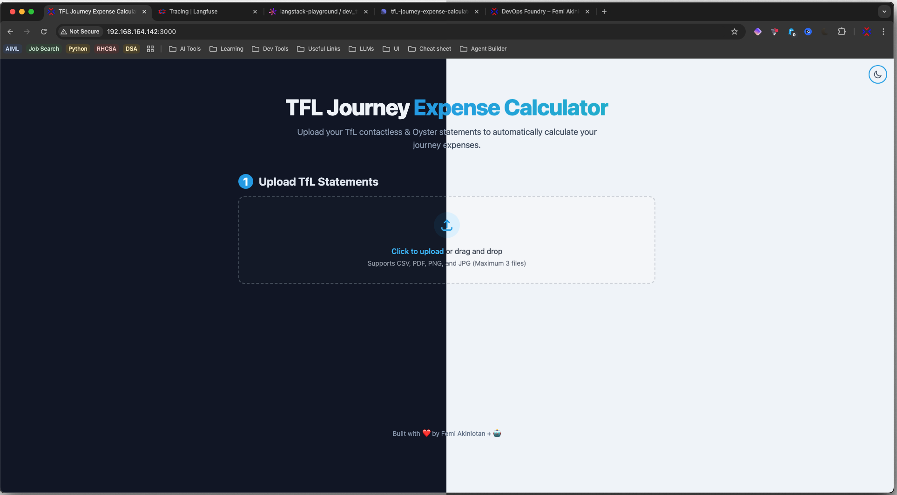
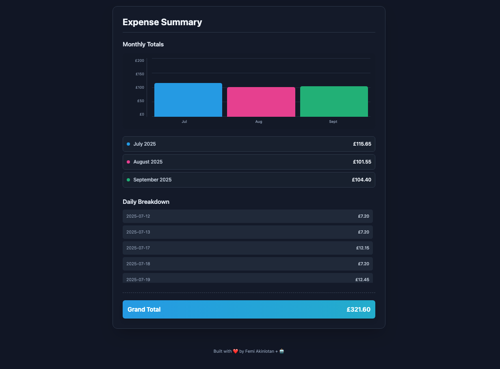
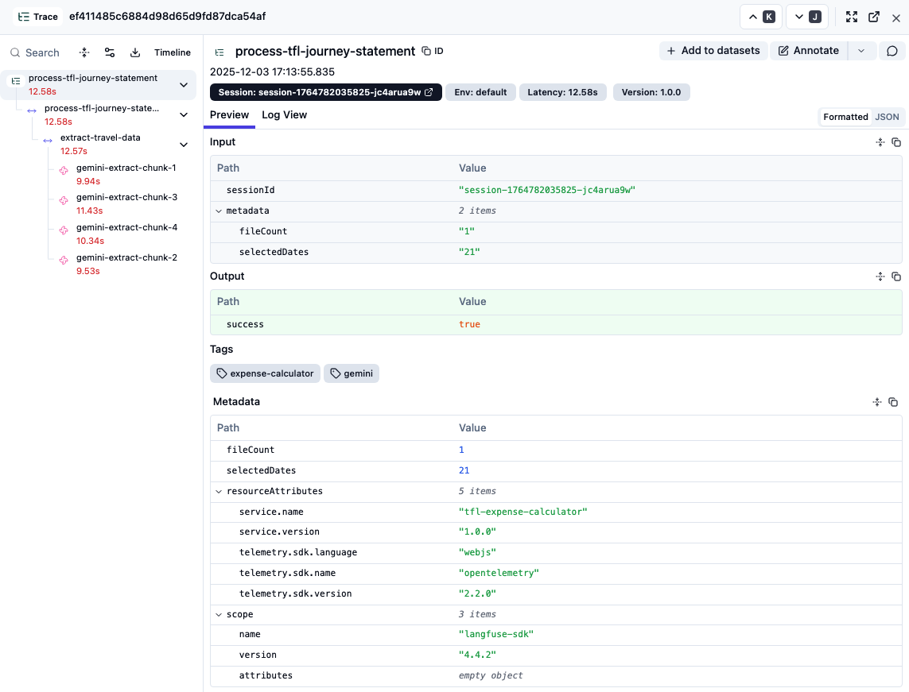

# 🚇 TFL Journey Expense Calculator

> **An AI-powered expense automation tool that transforms the tedious process of calculating transport reimbursements into a simple, intelligent workflow.**

[](https://www.typescriptlang.org/)
[](https://react.dev/)
[](https://ai.google.dev/)
[](https://langfuse.com/)

[](https://sonarcloud.io/summary/new_code?id=devopsfoundry_tfl-journey-expense-calculator)
[](https://sonarcloud.io/summary/new_code?id=devopsfoundry_tfl-journey-expense-calculator)
[](https://sonarcloud.io/summary/new_code?id=devopsfoundry_tfl-journey-expense-calculator)



## 🎯 The Problem

As an employee claiming transport reimbursement, calculating monthly travel expenses is a **time-consuming nightmare**:

- Manually matching journey dates with work days across multiple months
- Cross-referencing invoices with actual work days
- Calculating costs from multiple TfL statements
- Repeating this process every month

**This app eliminates that hassle entirely.**

## ✨ The Solution

An intelligent expense calculator that:

- 📤 **Accepts multiple file formats**: Upload CSV invoices, PDF statements, or images
- 🤖 **AI-powered extraction**: Uses Google Gemini to intelligently parse transport data
- 📅 **Visual date selection**: Simple calendar UI to select days you worked
- 💰 **Automatic calculation**: Instantly computes your total reimbursement
- 📊 **Smart summaries**: Generates clear, exportable expense reports
- 🔄 **Multi-invoice support**: Handles multiple TfL statements seamlessly



## 💡 Why This Project Matters

This isn't just another CRUD app it's a **production-ready AI agent** solving a real problem. Built to demonstrate:

- ✨ **Real-world AI application**: Not a tutorial project, but a tool people actually need
- 🏗️ **Production engineering**: Complete with observability, security, and error handling
- 🎯 **Problem-first approach**: Starting with user pain points, not tech
- 📈 **Scalable architecture**: Ready for real-world deployment and usage

Perfect for employees at companies with transport reimbursement policies, saves hours of manual work every month.

## 🧠 Technical Showcase

This project demonstrates advanced skills in **AI agent development** and **production-grade engineering**:

### AI Agent Architecture

- **Intelligent document parsing** using Google Gemini with structured prompts
- **Multi-modal AI processing** (text, PDF, images via OCR)
- **Context-aware data extraction** that understands TfL invoice formats
- **Structured output validation** ensuring data integrity
- **Performance-optimized processing**: PDF page-level chunking and parallel processing reduced latency by 78.5% (58.63s → 12.58s for large documents)

### Production Observability

Built-in **full-stack tracing** with Langfuse for production-grade AI monitoring. Using observability-driven optimization, we identified and resolved performance bottlenecks:


_Langfuse trace revealing document processing bottlenecks, leading to 78.5% latency reduction through intelligent chunking and parallelization_

### Enterprise Security

- **Zero client-side API key exposure** via secure backend proxy
- **CORS protection** and rate limiting
- **Production-ready architecture** with environment-based configuration

## 🛠️ Tech Stack

**Frontend**: React 19, TypeScript, Vite, PDF.js, Tesseract.js  
**Backend**: Node.js, Express, Google Gemini AI, Langfuse, OpenTelemetry  
**DevOps**: pnpm, Doppler, Concurrently

## 🚀 Quick Start

### Prerequisites

- Node.js (v18+)
- pnpm (or npm)
- Google Gemini API key ([Get one free](https://aistudio.google.com/app/apikey))

### Installation

1. **Clone and install**:

   ```bash
   git clone https://github.com/crypticseeds/tfl-journey-expense-calculator.git
   cd tfl-journey-expense-calculator
   pnpm install
   ```

2. **Configure environment**:

   Create a `.env` file:

   ```bash
   # Required: Google Gemini API Key
   GEMINI_API_KEY=your-gemini-api-key-here

   # Optional: Langfuse for AI observability (recommended)
   LANGFUSE_PUBLIC_KEY=pk-lf-...
   LANGFUSE_SECRET_KEY=sk-lf-...
   LANGFUSE_BASE_URL=https://cloud.langfuse.com
   ```

3. **Run the application**:

   ```bash
   pnpm run dev:all
   ```

   The app will be available at:
   - 🎨 Frontend: `http://localhost:3000`
   - 🔒 Backend API: `http://localhost:3001`

That's it! 🎉

## 🎬 Try It Out

The project includes sample TfL statements in the `/sample` folder:

- `Amex - 2003 - October 2025 (Journeys).pdf` - Sample journey PDF
- `Amex - 2003 - October 2025 (Payments).csv` - Sample payment CSV

**Quick walkthrough**:

1. Open `http://localhost:3000`
2. Click "Upload Files" and select the sample files
3. Select some dates in October 2025 on the calendar
4. Click "Calculate Expenses"
5. View your itemized expense report with total cost

Check the Langfuse dashboard (if configured) to see the full AI trace!

## 📖 Detailed Setup Options

### Using Doppler (Production Secret Management)

Doppler provides secure, centralized secret management:

```bash
# Install Doppler CLI
brew install doppler  # or see https://docs.doppler.com/docs/install-cli

# Login and setup
doppler login
doppler setup

# Run with Doppler
doppler run -- pnpm run dev
```

## 📋 How It Works

1. **Upload your TfL statements** (CSV, PDF, or images)
2. **Select the days you worked** using the interactive calendar
3. **Get your total** - the AI calculates your reimbursement instantly
4. **Export the summary** for your finance team

The AI agent intelligently:

- Extracts journey data from multiple formats
- Matches journeys to your work days
- Handles multiple invoices across different months
- Validates and merges data automatically

## 🔍 AI Observability with Langfuse

This project showcases **production-grade AI monitoring** using Langfuse:

### What's Tracked

- ✅ **Complete workflow traces** - See the entire expense calculation process
- ✅ **AI model calls** - Full Gemini API request/response details
- ✅ **Performance metrics** - Latency, token usage, and estimated costs
- ✅ **Error tracking** - Automatic capture of failures
- ✅ **Session grouping** - Group related operations for debugging

### Setup (Optional but Recommended)

1. Sign up for free at [cloud.langfuse.com](https://cloud.langfuse.com)
2. Get your API keys from the dashboard
3. Add them to your `.env` file
4. View traces in real-time as you use the app

## 🔒 Security

- ✅ **Backend Proxy Pattern**: All AI requests go through a secure server
- ✅ **Zero Client Exposure**: API keys never touch the browser
- ✅ **CORS Protection**: Only configured origins can access the API
- ✅ **Rate Limiting**: 30 requests/minute per IP

## 🐛 Troubleshooting

**"Failed to fetch" error**: Ensure backend is running (`pnpm run dev:server`) and check `http://localhost:3001/health` returns `{"status":"ok"}`

**"Invalid API key" error**: Get a valid key from [Google AI Studio](https://aistudio.google.com/app/apikey) and restart the backend server

## 🤝 Contributing

Contributions are welcome! Fork the repository, create a feature branch, and open a Pull Request.

---

**⭐ If you found this project interesting, please star the repo!**

---

<div align="center">

### 🔗 Connect with Me

[](https://devopsfoundry.com/projects/)
[](https://www.linkedin.com/in/femi-akinlotan/)
[](mailto:femi.akinlotan@devopsfoundry.com)

**Built with ❤️ by Femi Akinlotan**
